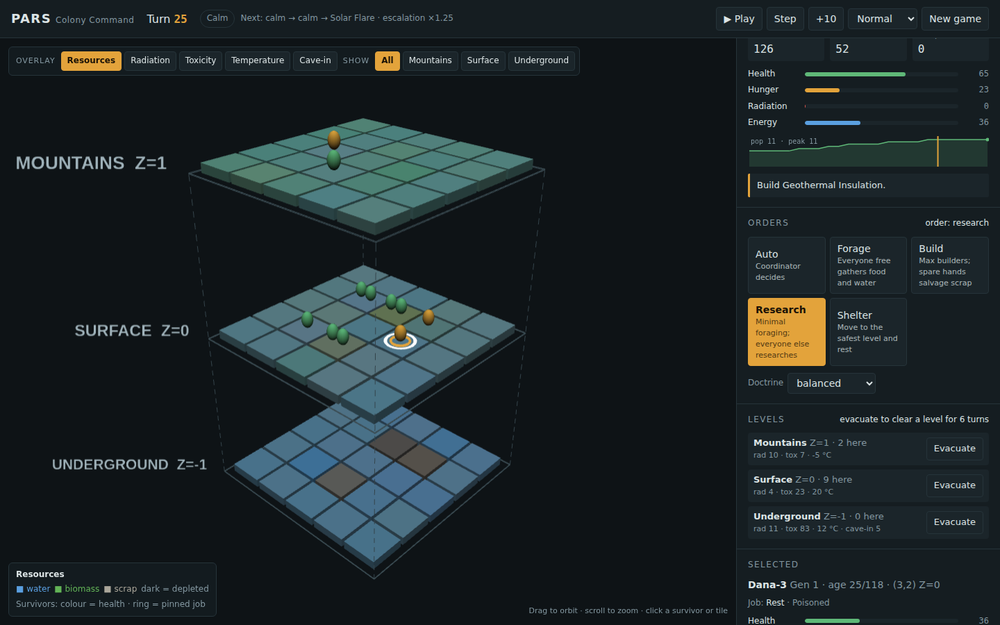
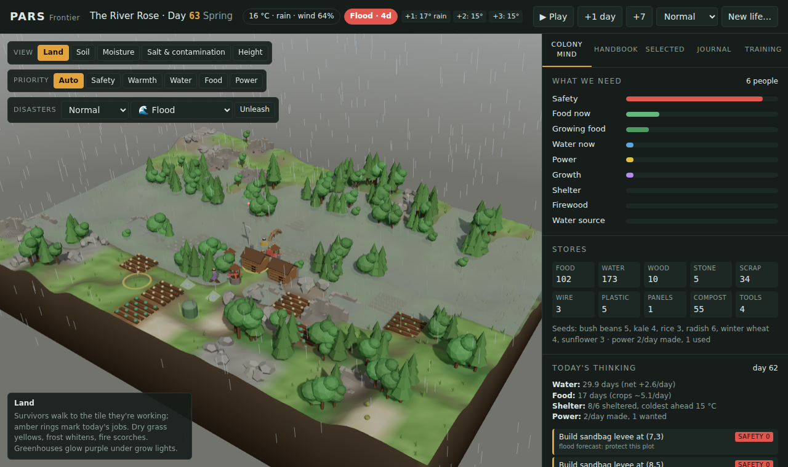

# Project PARS

**Post-disaster Evolutionary Survival Coordinator**: a 3D evolutionary survival simulator with genetic survivor agents, a strategic AI Coordinator, and a Rich-powered terminal dashboard.

## Lore

The world as you knew it is gone. A catastrophe shattered civilization, and small bands of survivors cling to life across three elevation zones:

- **Z=-1 Underground**: stable temperature and aquifers, but radon, toxic leaks and cave-ins.
- **Z=0 Surface**: the most food and salvage, exposed to acid rain, blizzards and solar flares.
- **Z=1 Mountains**: cold, thin air and cosmic radiation, with alpine biomass and wreckage.

Survivors age, breed and pass on mutated genes. An AI Coordinator reads the forecast, shelters people on the safest levels and staffs foraging, building and research. **You choose its doctrine.** Can it finish the tech tree before a worsening world wipes the colony out?

## Quick start

```bash
git clone https://github.com/Deep-De-coder/pars-simulator.git
cd pars-simulator
pip install -r requirements.txt

python -m pars.web                               # interactive 3D view in your browser
python main.py                                   # terminal dashboard, normal difficulty
python main.py --seed 42 --doctrine cautious --difficulty hard
python main.py --headless --seed 7               # no dashboard, status line every 10 turns
python -m pars.batch --runs 100 --difficulty all --doctrine all   # compare strategies
```

Python 3.9+. The only runtime dependency is `rich` (used only by the live dashboard).

## Interactive 3D mode

```bash
python -m pars.web                 # opens http://127.0.0.1:8765
python -m pars.web --seed 42 --difficulty hard --port 9000 --no-browser
```



The three levels are drawn as stacked slabs you can orbit (drag) and zoom (scroll). Everything runs locally: a small standard-library server runs the same Python simulation, and three.js is bundled in the repo, so no internet is needed.

- **Play, pause, step** (Space / `.`), choose a speed, or start a new colony with any seed, difficulty, doctrine and grid size.
- **Overlays**: resources, radiation, toxicity, temperature or cave-in risk. **Show** isolates one level when the others are in the way.
- **Click a survivor** to see their vitals and genes and **pin their job** (Forage, Research, Construct, Rest). Click a tile to see what's on it.
- **Orders** change what the coordinator does:
  - **Focus**: `auto` (coordinator decides), `forage`, `build`, `research` or `shelter`.
  - **Evacuate** a level for 6 turns. Survivors leave it and stay out. At least one level must stay open.
  - **Doctrine** can be switched mid-game.
- Disasters show as particles on the levels they hit. Your orders appear in the coordinator log.

**No install needed:** `python -m pars.web.build pars-3d.html --inline-three` writes one self-contained HTML file you can open by double-clicking or host anywhere. It runs a JavaScript port of the engine (`pars/web/static/engine.js`) in the page. The Python package stays the reference implementation; `tests/test_js_engine.py` checks the port's win rate against it (they matched within noise over 600–1000 games per difficulty).

Pinned survivors still flee danger, and the orders are the same commands the Python API exposes (`Simulation.set_focus`, `evacuate`, `pin_role`, `set_doctrine`).

## Frontier mode: start a new life anywhere

```bash
python -m pars.web            # then open http://127.0.0.1:8765/frontier
python -m pars.web.build frontier.html --frontier --inline-three   # one offline file
node pars/web/frontier-batch.js 40                                 # balance report
```



A second mode about *what you need to survive anywhere*. Survivors arrive somewhere hostile with a few tools, some seeds and a survival handbook, and work out day by day what to do next. One day is one tick; a game is one year.

The world is a 3D diorama: a smooth heightmap with slope-aware rock and soil, wind-swept grass (one instanced mesh, bent in the shader), a water surface that rises over low ground in a flood, a sky and fog that follow the weather (rain, snow, dust, ash, lightning), soft shadows, and survivors who walk to the tile they're working. While it plays, the sun crosses the sky once per day; at night there are stars and a moon, windows glow and grow lights stand out. The **Colony's model** view paints each spot with what the colony *believes* it is worth, from the model it built itself. Drag to orbit, scroll to zoom, click a tile or person to inspect it.

| Scenario | Situation | What it teaches |
|---|---|---|
| The River Rose | Spring flood, grid down | High ground, clean water, power from the river, fertile flood silt |
| Ash Winter | Autumn, ash-dimmed sun, contaminated soil | Shelter and firewood first, cold-hardy crops, sunflowers clean soil |
| Dry Country | Desert spring | Oases, wells in low ground, solar stills, irrigation channels |
| After the Wave | Tsunami coast, salted fields | Clean water, salt-tolerant crops, storms |
| Red Planet | A tribute to *The Martian* | Heated hab, water from ice, soil from regolith plus compost, potatoes under grow lights |

**The colony mind** ranks needs in the order survival instructors teach (the rule of threes: safety, then shelter, water, food, power), lists every action its handbook says is possible *right now* given the tiles, weather forecast and stores, works backwards to gather missing materials, and assigns people by skill. The **Colony mind** tab shows its reasoning each day: the needs, the options it weighed (including blocked ones and what they're missing), and who does what. The **Selected** tab has a crop advisor ("which crop here, now?") that uses the colony's beliefs, not the true numbers.

**Learning.** The handbook is deliberately wrong in places (corn "survives light frost", beans "don't mind wet feet", potatoes "survive a hard frost", an optimistic sweet-potato yield, wells that "work anywhere", nameplate wind and solar output, optimistic salvage and fishing rates). The colony corrects these from what actually happens and shows each correction as a 💡 note. It also discovers things the handbook never mentioned, such as flood silt making land more fertile, and it fits a rule for wells (water lies deeper under high ground) from the wells it digs, rather than just a table. Skills also improve with practice.

**Is it learning the right things?** The engine knows the hidden truth, so the **Handbook** tab scores every belief against it ("How right are we?") and keeps a yield book of handbook guesses vs. what work actually returned. Averages over 12 games per place (6 four-life runs for the "after 4 lives" column):

| Place | Start (handbook) | After 1 year | After 4 lives | Right, of facts with evidence (1 year) |
|---|---|---|---|---|
| The River Rose | 58% | 66% | 83% | 90% (6.3 facts) |
| Ash Winter | 67% | 73% | 88% | 100% (1.8) |
| Dry Country | 52% | 59% | 81% | 97% (1.7) |
| After the Wave | 70% | 74% | 91% | 100% (2.4) |
| Red Planet | 44% | 68% | 82% | 88% (0.6) |

What this does and doesn't show: where the colony has evidence it is nearly always right, but within one year it only gets evidence for a handful of facts. A frost limit is only revealed by a frost below it, flood tolerance by a flood over the crop, and a well rate by several wells. The colony doesn't go looking for that evidence, so most of the improvement comes from carrying knowledge across lives. Two fixes came out of measuring this: yield lessons are only announced when the gap beats 2.5 standard errors (false salvage "lessons" fell from 66 to 3 over 60 games, precision 55% → 93%), and crops that wilt in floodwater now teach the colony, not only crops that die (before, the colony learned nothing in 7 of 12 River Rose games where beans were flooded and survived). A frost death still gives only a bound ("dies at −4 °C"), not the exact limit.

**Learning in three loops.** Inspired by nested learning (several learning processes at different speeds) and double-loop learning (revising the model's assumptions, not just its numbers when errors persist):

| Loop | Speed | What changes | How |
|---|---|---|---|
| 1 | every observation | the numbers in the model (yields, limits, rates) | running estimates, significance-gated lessons; prediction error ("surprise") is logged |
| 2 | every 10 observations | **the model's structure**: which conditions an outcome depends on | for each stream (foraging, turbine output, harvests vs. expectation) try splitting by one more condition (ground, exact height, soil wetness, distance, season; cover, irrigation, planting season, soil richness); adopt it only if it wins on BIC *and* predicts better on held-out halves of the data; small groups are shrunk toward the mean |
| 3 | across lives | **how it learns**: evidence needed to revise, curiosity, trust in small samples (plus the decision weights) | cross-entropy search with the confirmation check below |

What loop 2 found, on its own (no slot for it was written): foraging depends on ground type. Colonies in sandy places discover it in 12–15 of 16 games (sand ≈ 0.46 of the handbook vs. grass ≈ 0.89; the hidden truth is half) and stop foraging on sand (38% → 10% of trips in After the Wave, 31% → 21% in Dry Country). Getting there exposed learner bugs worth knowing about: logging every turbine every day gave the model a two-week memory, and the changing turbine mix looked like a seasonal effect (a false "season" discovery in all 16 Mars games; one turbine sampled every other day fixed it, 3/16). Coarse height bands also let season act as a proxy until exact height was used. Its limits are measurable too: Mars turbine output is so noisy (storms) that height is detectable in only ~1 of 10 games' worth of data, even with robust tests. Outcomes vs. without loop 2: +1.4 ± 1.4 (within noise).

Other options explored:
- **Curiosity** (try conditions with little evidence): for turbine siting it did not produce the hoped-for discoveries on Mars, but it measurably helped Mars colonies (+6.9 ± 2.5 over 300 paired games; perished 55 → 39). They build fewer turbines (21 vs. 25) at similar heights, so the gain appears to come from freed wire, scrap and labour, not from learning.
- **Skeptical knowledge transfer** (`transfer: "skeptical"`): disaster lessons inherited from other lives stay dormant until that disaster strikes here. It edges out naive transfer (+0.6 ± 0.7, not significant), so it is an option rather than the default.

**Disasters.** Ten kinds, each with its own mechanics, a handbook response and, for most, a lesson the colony can only learn by living through it:

| Disaster | What happens | Handbook response | Learned from experience |
|---|---|---|---|
| Flood | River rises over low ground | High ground, sandbags, harvest early | Flood silt makes land fertile |
| Storm | Wind and rain wreck exposed structures | Shelter, repair afterwards | |
| Cold snap | Temperatures plunge | Fires, greenhouses | Each crop's real cold limit |
| Drought / heatwave | No rain, extra thirst | Ration, wells in low ground, irrigate | |
| Ashfall | Sun blotted out | Stores, wind and water power | |
| Wildfire | Spreads by wind, dryness and fuel; rain stops it | Fight with water, cut firebreaks | Firebreak ring before dry season; ash is fertile |
| Earthquake | Cracks buildings, collapses wells; aftershocks | Repair | Wait for aftershocks before rebuilding |
| Crop blight | Fungus jumps plant to plant | Pull infected plants | Mix crops (it spreads along one crop) |
| Fever outbreak | Spreads between people; worse after dirty water | Rest the sick | Always boil drinking water |

Set how often they strike (calm, normal, frequent, relentless) or **unleash** any disaster yourself from the Disasters control.

**Training.** Learning also carries across lives:

- *Remember what they learned & start again* at the end of a year: the next colony inherits every correction and lesson.
- `node pars/web/static/frontier-train.js` (parallel, about 30 minutes) builds the *Pre-trained veteran* in `frontier-brain.js`:
  1. It lives 60 simulated years across all five places, each year inheriting the last one's knowledge.
  2. For each place, it tests every piece of knowledge on its own against the novice, on the same validation games, and keeps a piece only with solid evidence (at least 2 standard errors).
  3. For each place, it searches the colony's 25 decision weights (including three that control how the colony learns) with a cross-entropy method. Candidates are scored by their advantage over the defaults on identical games, and the result is kept only if it beats the defaults on separate validation games (again at 2 standard errors).
  4. Each place's chosen bundle is then compared with the novice **once** on 60 games that played no part in choosing it, and kept only if it wins by 2 standard errors there.
  5. It reports results on fresh seeds that played no part in any of those choices.

  Step 4 was added after the same failure happened three times: a pick passed validation and then lost on the test (boil water in The River Rose, boil water in Dry Country, and tuned weights in Ash Winter, +7.5 ± 2.2 on validation, then 44 → 41 thriving). The cause was the winner's curse. The validation games were used to screen 8 lessons and pick the best of 9 weight sets, and then to judge that pick, so its score was inflated. With the confirmation step, the first pick it checked (a firebreak lesson for The River Rose, +5.9 ± 2.5 on validation) scored +3.3 ± 2.0 on unseen games and was dropped.

  Result: a first run kept nothing (the veteran played exactly like the novice). A bigger run (80 years of experience; 12 generations of 16 weight sets per place; 60 validation and 100 confirmation games per place; about 70 minutes) kept one thing, **Red Planet's tuned decisions**: +10.3 ± 4.9 on the 100 confirmation games, then **+9.7 ± 3.6 on 200 further fresh Mars games (thriving 118 → 151, perished 42 → 36)**. Its own 48-game final test had shown a small loss (perished 6 → 10), which the larger test overturned. Everywhere else the veteran plays like the novice. On a fresh 240-game set: novice 87% thriving and 4% perished, veteran 90% and 3%, never worse than the novice in any place.

**Rounds of improvement.** The gains came from diagnosing where colonies fail and giving the colony knowledge a real survivor could have, not the answers. Each change was kept only if a paired A/B on fresh seeds showed it wasn't harmful:

| Round | What was missing | What the colony got | Paired A/B |
|---|---|---|---|
| 1 | Mars potatoes froze when storms tore greenhouse covers | Brace covers before storms; patch a torn cover the same day (only if the crop would freeze, by its own frost beliefs); lights off over empty beds; learn from power-cut freezes | Mars perished 12 → 3 of 40 |
| 2 | Dry Country fields sat empty all winter: greenhouses were only considered in cold climates | Ask the crop advisor "what could I grow here under a cover, or a cover with lights?" and build when the gain is large | +4.1 ± 1.4 (Dry Country thriving 52 → 72 of 80) |
| 3 | Mars colonies replanted into dark greenhouses after power failures, and one low-output day froze every lit plot | Only count on lights that will have power; reserve power per lit planting; where a cut would kill even the hardiest crop, plan on bad days (10th percentile of its own 30-day power record) | +3.1 ± 1.5 (Mars thriving 19 → 50 of 80) |
| 4 | Greenhouse potatoes cooked in summer (61% of full speed) | Learn to vent after seeing heat stalls | neutral (+0.3 ± 0.7), kept for realism |
| 5 | Seedlings killed by forecast cold snaps (126 of 128 frost losses); Mars farms stalled for want of wire while 300 scrap piled up; Mars output swung from 40–60 to 0–10 on ordinary days | Cover plants when frost is forecast; battery banks (built only once lit crops need protecting); strip wire out of scrap | Frost covers neutral (crop losses 10.7 → 6.7 a game in River Rose); batteries + wire: Mars +8.0 ± 3.1, thriving 107 → 127 and perished 42 → 26 of 200 |

Tried and reverted: sizing the farm up (more fields hurt Ash Winter and Dry Country, where labour is the limit); watering every crop to its need (−1 to −8 on Earth, where water is hauled by hand; left as a trainable weight defaulting to off); only running the radio when food covers another person (−8.0 ± 0.9); gathering more when a food lull can be foreseen from the growing crops (River Rose thriving 69 → 48). A first battery rule built banks before any plot was lit and spent the wire the grow lights needed; it now waits for lit crops. Some fixes had to be made consequence-aware after a first version hurt another place: patching and bracing cost Ash Winter until they were gated on the crop actually freezing, and planning on bad-day power cost Ash Winter −7.6 until it was limited to places where a cut is lethal.

  On Earth, lost crops turned out not to limit outcomes (seed is plentiful, colonies replant), so knowledge that only saves crops there is neutral. Overall, rounds 1–4 vs. the engine before them, on 240 fresh paired games: **+8.1 ± 2.2 points/year**. Thriving went from 69% to 82% and colonies lost from 19 to 9. By place: Red Planet thriving 8 → 28 and perished 17 → 9, Dry Country 32 → 40, Ash Winter 38 → 42 (perished 2 → 0), River Rose flat, After the Wave −2.1 ± 2.5 (within noise). What remains: Mars still loses about 1 colony in 5 to weeks-long power collapses and a first harvest that comes too late for the starting stores.
- The **Training** tab shows those results and the training curve, and can keep training in the page (live 10 more years, or evolve 3 more generations). Your own colony is saved in the browser.

**What you can do:** set a colony priority, or click a tile to order a field tilled, a crop planted or a structure built. Invalid orders are refused with the reason. Overriding the colony has consequences: pinning *Water* forever can starve everyone.

The Frontier engine is JavaScript only (`pars/web/static/frontier-*.js`), so it runs in the browser. `tests/test_frontier.py` drives it through Node.

## How a turn works

1. **Environment**: the next forecast event starts on a calm turn. Hazards hit the levels each disaster affects, then decay toward each level's baseline (half-life of about 4 turns). Resources regrow. *Escalation* raises disaster frequency and intensity over time.
2. **Coordinator**: unlocks the cheapest tech it can afford, then scores each level's expected damage *for each survivor* (their genes, the colony's tech, and radiation build-up) and relocates anyone whose level is clearly worse. It sets a plan (disaster response, forage priority, health focus, build, expand, balanced), staffs foragers against a target supply buffer, and fills builder and researcher roles by gene fit.
3. **Survivors**: the hungriest eat first. Then metabolism and exposure apply (starvation, radiation, cold, toxicity, cave-ins, old age), and each survivor carries out their role.
4. **Colony**: the dead are recorded with their largest damage source as cause of death. Same-level pairs may breed if supplies cover a reserve (births are capped per turn, and population at 30). Finished tech is marked complete.

### Genetics

Five inheritable traits (`speed`, `foraging`, `rad_resistance`, `cold_resistance`, `intelligence`, about 0.6–1.4 at start). A child blends its parents' values with uniform crossover and has a 15% chance per gene of a ±0.25 mutation. Lifespans are 90–140 turns, so a colony has to keep breeding to survive.

### Disasters

| Disaster | Hits | Effect |
|---|---|---|
| Acid Rain | Surface, Mountains (less) | Toxicity, destroys surface biomass |
| Blizzard | Mountains, Surface | Severe cold (feeds mountain water) |
| Solar Flare | Mountains, Surface | Radiation spike |
| Radon Leak | Underground | Toxic gas |
| Cave-In Threat | Underground | Cave-in chance rises (15–40 damage per collapse) |

The header forecast is accurate: entry *n* is what happens on the *n*-th calm turn from now.

### Tech tree

Research points (RP) unlock projects, and builders spend scrap to complete them. Costs scale with difficulty.

| Project | RP | Scrap | Effect |
|---|---|---|---|
| Underground Reinforcement | 20 | 40 | -75% cave-in chance, -50% radon toxicity |
| Geothermal Insulation | 30 | 50 | Survivors feel +12 °C warmer |
| Water Filtration Rig | 40 | 60 | +6 water per turn |
| Automated Hydroponics | 50 | 80 | +6 biomass per turn |
| Cosmic Ray Deflector | 60 | 100 | Halves radiation exposure |
| Sub-space Radio Beacon | 80 | 150 | Attracts new survivors |

### Win / lose

- **RESTORATION**: all 6 projects complete, 8+ survivors alive, average health above 60.
- **EXTINCTION**: everyone is dead.
- **Score**: a win scores 1000, plus 10 per survivor, plus 2 per turn under 300. A loss scores 60 per tech completed, plus half the turns survived, plus 5 per survivor. Every win outscores every loss.

## Doctrines and difficulty

The doctrine is the player's strategic lever:

| Doctrine | Style |
|---|---|
| `balanced` | React to danger early, keep a healthy buffer, build steadily |
| `cautious` | Flee any hint of danger and hoard supplies. Safest, slowest |
| `industrious` | Salvage hard, many builders, lean supplies. Fastest, riskier |
| `expansionist` | Breed early and often, big colonies |

Difficulty presets (`easy`, `normal`, `hard`, `nightmare`) scale disaster frequency, intensity, duration and escalation, resource regrowth, tech cost and starting supplies (see `pars/config.py`).

Measured with `python -m pars.batch --runs 100 --difficulty all --doctrine all` (seeds 0–99). Each cell shows win rate and median turns to win:

| | balanced | cautious | industrious | expansionist |
|---|---|---|---|---|
| easy | 100% / 78 | 100% / 91 | 100% / 70 | 100% / 79 |
| normal | 89% / 118 | 91% / 154 | 78% / 99 | 90% / 118 |
| hard | 68% / 159 | 85% / 223 | 55% / 126 | 67% / 160 |
| nightmare | 39% / 196 | 55% / 305 | 23% / 151 | 38% / 195 |

No doctrine is best everywhere. By mean score, industrious leads on easy, balanced and expansionist on normal, and cautious on hard and nightmare.

## Command-line options

`main.py`:

| Option | Default | Description |
|---|---|---|
| `--width`, `--height` | 5 | Grid size (min 3) |
| `--population` | 6 | Starting survivors |
| `--seed` | random | Seed for a reproducible run |
| `--difficulty` | normal | `easy`, `normal`, `hard`, `nightmare` |
| `--doctrine` | balanced | `balanced`, `cautious`, `industrious`, `expansionist` |
| `--delay` | 500 | Milliseconds between dashboard frames |
| `--max-turns` | 0 | Stop after N turns (0 = until win or extinction) |
| `--headless` | off | No dashboard; print a status line every `--report-every` turns (0 = summary only) |
| `--export PATH` | none | Write settings, stats and per-turn history as JSON |

Every run ends with a report: outcome, score, tech timeline, deaths by cause, and gene drift in the living colony.

`python -m pars.batch`: `--runs`, `--start-seed`, `--difficulty` and `--doctrine` (both accept `all`), `--max-turns`, `--jobs` (parallel worker processes), and `--json PATH` (one JSON line per run).

## Dashboard


- **Header**: active disaster, 3-step forecast, difficulty, doctrine, escalation.
- **3D maps**: one slice per level with average radiation, toxicity and temperature. Symbols: `◉` survivor (`⚠` in distress, `⚕` badly hurt); hazards `☣` toxic, `☢` irradiated, `▼` cave-in risk, `❄` freezing; resources `♣` biomass, `≈` water, `■` scrap.
- **Colony stats**: vitals, stockpile, RP, population per level, latest generation and gene averages.
- **Tech tree**, **survivor table** (genes, role, status), **coordinator log**, and the active plan.

## Project structure

```
pars-simulator/
├── main.py              # CLI entry point
├── pars/
│   ├── config.py        # Difficulty presets and doctrines
│   ├── environment.py   # 3D grid, weather/forecast, hazards, regrowth
│   ├── survivor.py      # Survivor agents: genes, metabolism, actions, breeding
│   ├── coordinator.py   # AI Coordinator: hazard scoring, plans, role staffing
│   ├── tech.py          # Tech tree and protections
│   ├── simulation.py    # Turn loop, stats, history, export
│   ├── report.py        # End-of-run report and score
│   ├── batch.py         # Multi-seed analysis CLI
│   ├── dashboard.py     # Rich live terminal dashboard
│   └── web/             # Interactive 3D browser mode (server + three.js page)
└── tests/               # pytest suite
```

## Development

```bash
pip install -r requirements.txt -r requirements-dev.txt
python -m pytest -q
```

CI (GitHub Actions) runs the tests on Python 3.9, 3.11 and 3.12, plus a small balance smoke test.

## License

MIT
