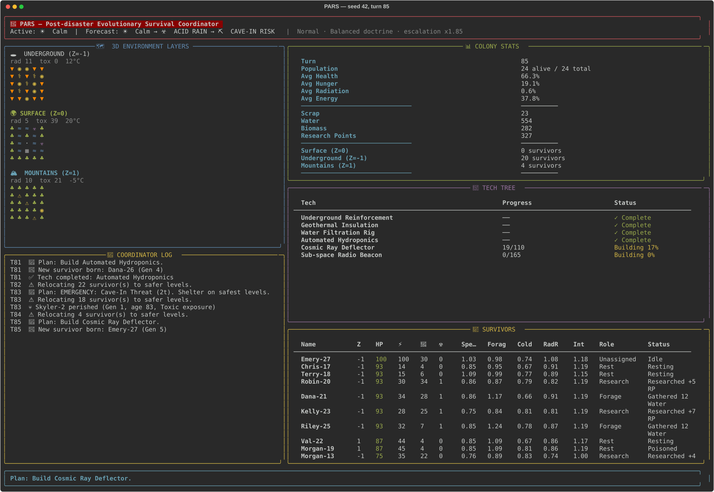

# Project PARS

**Post-disaster Evolutionary Survival Coordinator**: a 3D evolutionary survival simulator with genetic survivor agents, a strategic AI Coordinator, and a Rich-powered terminal dashboard.

## Lore

The world as you knew it is gone. A catastrophe shattered civilization, and small bands of survivors cling to life across three elevation zones:

- **Z=-1 Underground**: stable temperature and aquifers, but radon, toxic leaks and cave-ins.
- **Z=0 Surface**: the most food and salvage, exposed to acid rain, blizzards and solar flares.
- **Z=1 Mountains**: cold, thin air and cosmic radiation, with alpine biomass and wreckage.

Survivors age, breed and pass on mutated genes. An AI Coordinator reads the forecast, shelters people on the safest levels and staffs foraging, building and research. **You choose its doctrine.** Can it finish the tech tree before a worsening world wipes the colony out?

## Quick start

```bash
git clone https://github.com/Deep-De-coder/pars-simulator.git
cd pars-simulator
pip install -r requirements.txt

python main.py                                   # live dashboard, normal difficulty
python main.py --seed 42 --doctrine cautious --difficulty hard
python main.py --headless --seed 7               # no dashboard, status line every 10 turns
python -m pars.batch --runs 100 --difficulty all --doctrine all   # compare strategies
```

Python 3.9+. The only runtime dependency is `rich` (used only by the live dashboard).

## How a turn works

1. **Environment**: the next forecast event starts on a calm turn. Hazards hit the levels each disaster affects, then decay toward each level's baseline (half-life of about 4 turns). Resources regrow. *Escalation* raises disaster frequency and intensity over time.
2. **Coordinator**: unlocks the cheapest tech it can afford, then scores each level's expected damage *for each survivor* (their genes, the colony's tech, and radiation build-up) and relocates anyone whose level is clearly worse. It sets a plan (disaster response, forage priority, health focus, build, expand, balanced), staffs foragers against a target supply buffer, and fills builder and researcher roles by gene fit.
3. **Survivors**: the hungriest eat first. Then metabolism and exposure apply (starvation, radiation, cold, toxicity, cave-ins, old age), and each survivor carries out their role.
4. **Colony**: the dead are recorded with their largest damage source as cause of death. Same-level pairs may breed if supplies cover a reserve (births are capped per turn, and population at 30). Finished tech is marked complete.

### Genetics

Five inheritable traits (`speed`, `foraging`, `rad_resistance`, `cold_resistance`, `intelligence`, about 0.6–1.4 at start). A child blends its parents' values with uniform crossover and has a 15% chance per gene of a ±0.25 mutation. Lifespans are 90–140 turns, so a colony has to keep breeding to survive.

### Disasters

| Disaster | Hits | Effect |
|---|---|---|
| Acid Rain | Surface, Mountains (less) | Toxicity, destroys surface biomass |
| Blizzard | Mountains, Surface | Severe cold (feeds mountain water) |
| Solar Flare | Mountains, Surface | Radiation spike |
| Radon Leak | Underground | Toxic gas |
| Cave-In Threat | Underground | Cave-in chance rises (15–40 damage per collapse) |

The header forecast is accurate: entry *n* is what happens on the *n*-th calm turn from now.

### Tech tree

Research points (RP) unlock projects, and builders spend scrap to complete them. Costs scale with difficulty.

| Project | RP | Scrap | Effect |
|---|---|---|---|
| Underground Reinforcement | 20 | 40 | -75% cave-in chance, -50% radon toxicity |
| Geothermal Insulation | 30 | 50 | Survivors feel +12 °C warmer |
| Water Filtration Rig | 40 | 60 | +6 water per turn |
| Automated Hydroponics | 50 | 80 | +6 biomass per turn |
| Cosmic Ray Deflector | 60 | 100 | Halves radiation exposure |
| Sub-space Radio Beacon | 80 | 150 | Attracts new survivors |

### Win / lose

- **RESTORATION**: all 6 projects complete, 8+ survivors alive, average health above 60.
- **EXTINCTION**: everyone is dead.
- **Score**: a win scores 1000, plus 10 per survivor, plus 2 per turn under 300. A loss scores 60 per tech completed, plus half the turns survived, plus 5 per survivor. Every win outscores every loss.

## Doctrines and difficulty

The doctrine is the player's strategic lever:

| Doctrine | Style |
|---|---|
| `balanced` | React to danger early, keep a healthy buffer, build steadily |
| `cautious` | Flee any hint of danger and hoard supplies. Safest, slowest |
| `industrious` | Salvage hard, many builders, lean supplies. Fastest, riskier |
| `expansionist` | Breed early and often, big colonies |

Difficulty presets (`easy`, `normal`, `hard`, `nightmare`) scale disaster frequency, intensity, duration and escalation, resource regrowth, tech cost and starting supplies (see `pars/config.py`).

Measured with `python -m pars.batch --runs 100 --difficulty all --doctrine all` (seeds 0–99). Each cell shows win rate and median turns to win:

| | balanced | cautious | industrious | expansionist |
|---|---|---|---|---|
| easy | 100% / 78 | 100% / 91 | 100% / 70 | 100% / 79 |
| normal | 89% / 118 | 91% / 154 | 78% / 99 | 90% / 118 |
| hard | 68% / 159 | 85% / 223 | 55% / 126 | 67% / 160 |
| nightmare | 39% / 196 | 55% / 305 | 23% / 151 | 38% / 195 |

No doctrine is best everywhere. By mean score, industrious leads on easy, balanced and expansionist on normal, and cautious on hard and nightmare.

## Command-line options

`main.py`:

| Option | Default | Description |
|---|---|---|
| `--width`, `--height` | 5 | Grid size (min 3) |
| `--population` | 6 | Starting survivors |
| `--seed` | random | Seed for a reproducible run |
| `--difficulty` | normal | `easy`, `normal`, `hard`, `nightmare` |
| `--doctrine` | balanced | `balanced`, `cautious`, `industrious`, `expansionist` |
| `--delay` | 500 | Milliseconds between dashboard frames |
| `--max-turns` | 0 | Stop after N turns (0 = until win or extinction) |
| `--headless` | off | No dashboard; print a status line every `--report-every` turns (0 = summary only) |
| `--export PATH` | none | Write settings, stats and per-turn history as JSON |

Every run ends with a report: outcome, score, tech timeline, deaths by cause, and gene drift in the living colony.

`python -m pars.batch`: `--runs`, `--start-seed`, `--difficulty` and `--doctrine` (both accept `all`), `--max-turns`, `--jobs` (parallel worker processes), and `--json PATH` (one JSON line per run).

## Dashboard



- **Header**: active disaster, 3-step forecast, difficulty, doctrine, escalation.
- **3D maps**: one slice per level with average radiation, toxicity and temperature. Symbols: `◉` survivor (`⚠` in distress, `⚕` badly hurt); hazards `☣` toxic, `☢` irradiated, `▼` cave-in risk, `❄` freezing; resources `♣` biomass, `≈` water, `■` scrap.
- **Colony stats**: vitals, stockpile, RP, population per level, latest generation and gene averages.
- **Tech tree**, **survivor table** (genes, role, status), **coordinator log**, and the active plan.

## Project structure

```
pars-simulator/
├── main.py              # CLI entry point
├── pars/
│   ├── config.py        # Difficulty presets and doctrines
│   ├── environment.py   # 3D grid, weather/forecast, hazards, regrowth
│   ├── survivor.py      # Survivor agents: genes, metabolism, actions, breeding
│   ├── coordinator.py   # AI Coordinator: hazard scoring, plans, role staffing
│   ├── tech.py          # Tech tree and protections
│   ├── simulation.py    # Turn loop, stats, history, export
│   ├── report.py        # End-of-run report and score
│   ├── batch.py         # Multi-seed analysis CLI
│   └── dashboard.py     # Rich live dashboard
└── tests/               # pytest suite
```

## Development

```bash
pip install -r requirements.txt -r requirements-dev.txt
python -m pytest -q
```

CI (GitHub Actions) runs the tests on Python 3.9, 3.11 and 3.12, plus a small balance smoke test.

## License

MIT
